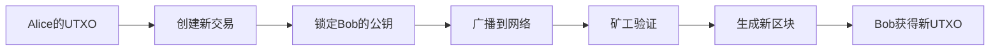

### **UTXO模型深度解析**

#### **1. UTXO模型概念**
UTXO（Unspent Transaction Output）是比特币采用的账户模型，其核心思想是**交易输出的不可变性**：
- 每笔交易的输出被标记为"已花费"或"未花费"
- 只有未花费的输出（UTXO）可以作为新交易的输入
- 不存在传统账户的"余额"概念，而是通过UTXO集合动态计算资产

#### **2. UTXO结构**
```python
class UTXO:
    def __init__(self, txid: str, index: int, value: float, scriptPubKey: str):
        self.txid = txid  # 交易哈希
        self.index = index  # 输出索引
        self.value = value  # 比特币数量
        self.scriptPubKey = scriptPubKey  # 锁定脚本（公钥哈希）
```

#### **3. 交易流程**


#### **4. 核心机制**
- **双重支付防御**：每个UTXO只能被使用一次
- **隐私保护**：通过脚本系统实现"条件支付"
- **可扩展性**：交易验证无需全局状态

#### **5. 实际案例**
```
交易1（创世交易）:
Input: None
Outputs:
0: 50 BTC → Alice (scriptPubKey: OP_DUP OP_HASH160 [Alice's PubKeyHash] OP_EQUALVERIFY OP_CHECKSIG)

交易2（Alice→Bob）:
Inputs:
0: TX1的Output0
Outputs:
0: 49.99 BTC → Bob (scriptPubKey: OP_DUP OP_HASH160 [Bob's PubKeyHash] OP_EQUALVERIFY OP_CHECKSIG)
1: 0.01 BTC → Alice (找零)
```


### **比特币挖矿深度分析**

#### **1. 挖矿算法原理**
- **SHA-256哈希计算**：
  ```python
  def sha256(data: bytes) -> str:
      return hashlib.sha256(data).hexdigest()
  ```
- **工作量证明**：寻找Nonce使哈希值满足难度要求
  ```
  target = 0x00000000FFFFFFFFFFFFFFFFFFFFFFFFFFFFFFFFFFFFFFFFFFFFFFFFFFFFFFFF
  while True:
      block_hash = sha256(header + nonce)
      if int(block_hash, 16) < target:
          break
      nonce += 1
  ```

#### **2. 挖矿奖励机制**
- **区块奖励**：
    - 初始50 BTC → 每210,000区块减半
    - 当前奖励3.12 BTC
- **手续费收入**：
    - 交易发起者支付的费用
    - 计算公式：手续费 = 交易大小（字节） × 费率（BTC/字节）

#### **3. 难度调整算法**
- **目标公式**：
  ```
  new_difficulty = old_difficulty × (actual_time / target_time)
  ```
- **动态平衡**：
    - 每2016区块（约2周）调整一次
    - 当实际出块时间 < 10分钟 → 难度增加
    - 当实际出块时间 > 10分钟 → 难度降低

#### **4. 矿池运作模式**
- **PPS模式（Pay Per Share）**：
  ```
  矿工收益 = 提交的有效份额 × (区块奖励 + 手续费) / 全网总份额
  ```
- **PPLNS模式（Pay Per Last N Shares）**：
  ```
  矿工收益 = 最近N个区块奖励 × (个人贡献份额 / 矿池总贡献份额)
  ```

#### **5. 挖矿经济学**
- **成本构成**：
  ```
  每日成本 = 矿机功耗(kW) × 电价($/kWh) × 24h
  ```
- **收益计算**：
  ```
  每日收益 = (区块奖励 + 手续费) × 全网算力占比
  ```
- **关机币价**：
  ```
  关机价 = (每日成本 / 每日收益) × 当前币价
  ```


### **知识总结**
| 知识点       | 核心要点                                                                 |
|--------------|--------------------------------------------------------------------------|
| UTXO模型     | 基于交易输出的不可变性，通过脚本系统实现条件支付，防止双重支付           |
| 挖矿算法     | SHA-256哈希碰撞，难度动态调整，工作量证明机制                           |
| 挖矿奖励     | 区块奖励减半机制，手续费市场定价，矿池收益分配模式                       |
| 安全机制     | 51%攻击门槛，哈希算法单向性，最长链原则                                 |
| 经济模型     | 矿工理性博弈，关机币价计算，算力动态平衡                               |

通过UTXO模型和挖矿机制的结合，比特币实现了去中心化、不可篡改的价值转移系统，其安全性和稳定性依赖于全网算力的分布式博弈和数学算法的保证。


参考文档 [git w3 BTC原理](https://github.com/Base1-Go/Web3/blob/main/3.BTC%E5%8E%9F%E7%90%86/BTC%E5%8E%9F%E7%90%86%E5%9F%BA%E7%A1%80.md)