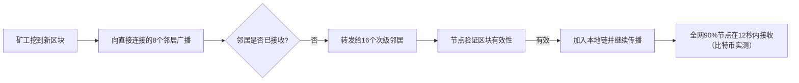

### **区块链P2P网络技术报告：节点发现与数据传播**


#### **一、P2P网络核心价值**
区块链P2P网络是去中心化的基础设施，支撑三大核心功能：
1. **节点自组织**：无需中心服务器，节点通过DHT动态发现邻居
2. **数据抗审查**：基于gossip协议的广播，避免单点故障
3. **状态同步**：通过区块/交易的快速传播，维持全网账本一致

**对比传统C/S架构**：

| 特性         | P2P网络                  | 中心服务器              |
|--------------|--------------------------|-------------------------|
| 单点故障     | 无（N个节点冗余）        | 存在（服务器宕机瘫痪）  |
| 扩展性       | 线性扩展（节点越多越快） | 指数成本（服务器扩容）  |
| 隐私性       | 节点匿名（IP隐藏）       | 数据集中易泄露          |


#### **二、节点发现机制（以Kademlia DHT为例）**

##### **1. 核心算法**
- **节点ID**：20字节随机数（比特币）/ 512位十六进制（以太坊）
- **路由表**：按XOR距离分组的KBucket（每个桶保存α个最近节点）
- **查询流程**：
  ```mermaid
  graph TD
  A[新节点启动] --> B[连接引导节点]
  B --> C{本地KBucket是否有记录?}
  C -->|是| D[直接建立连接]
  C -->|否| E[发起FIND_NODE查询]
  E --> F[递归查询最近的α个节点]
  F --> G[更新本地路由表]
  G --> H[建立长期连接]
  ```

##### **2. 比特币节点发现流程**
```go
// 简化版节点发现逻辑（基于比特币协议）
func discoverNodes(bootstrapNodes []string) {
    routingTable := newKBucket()
    for _, node := range bootstrapNodes {
        // 1. 发送version消息建立连接
        conn, err := dial(node)
        if err != nil { continue }
        
        // 2. 交换addr消息获取邻居节点
        go func() {
            for {
                var msg addrMessage
                if err := readMessage(conn, &msg); err != nil { break }
                for _, peer := range msg.Nodes {
                    if routingTable.add(peer.ID, peer.Addr) {
                        go discoverNodes([]string{peer.Addr}) // 递归发现
                    }
                }
            }
        }()
    }
}
```

##### **3. 以太坊的RLPx协议优化**
- **节点认证**：基于ECDH密钥交换，防止女巫攻击
- **状态压缩**：每个节点维护512个KBucket（对应512位节点ID）
- **查询并行化**：每次FIND_NODE查询并行请求16个节点（α=16）


#### **三、数据传播协议（以区块同步为例）**

##### **1. 传播流程图**


##### **2. 传播算法对比**
| 协议       | 比特币              | 以太坊（GossipSub）       | 优势                     |
|------------|---------------------|---------------------------|--------------------------|
| 洪泛范围   | 直接邻居→全网       | 基于兴趣组（topic）订阅   | 减少无效传输             |
| 优先级     | 交易→区块           | Gas费高的交易优先         | 提升用户体验             |
| 防重复     | 布隆过滤器          | 交易ID缓存（24小时）      | 降低网络负载             |

##### **3. 以太坊的快速同步**
```python
# 简化版区块同步逻辑（基于eth/66协议）
def syncBlocks(peer):
    local_height = getCurrentHeight()
    peer_height = peer.getHeight()
    
    if peer_height > local_height + 1000:
        # 快照同步：下载最近1000个区块
        downloadSnapshots(peer, local_height, peer_height)
    else:
        # 增量同步：逐个请求缺失区块
        for i in range(local_height+1, peer_height+1):
            block = peer.requestBlock(i)
            if validateBlock(block):
                addToBlockchain(block)
```


#### **四、典型案例分析**

##### **1. 比特币P2P网络**
- **节点规模**：约1.5万个全节点（2025年）
- **连接数**：每个节点维持8-12个长期连接
- **延迟**：新区块传播到全网50%节点需约6秒

##### **2. 以太坊P2P网络**
- **协议升级**：从eth/63到eth/66，支持状态证明
- **带宽优化**：引入RLPx压缩，单区块传输降至<100KB
- **抗攻击**：通过节点ID与IP解耦，抵御eclipse攻击


#### **五、挑战与解决方案**

| 问题               | 影响                     | 解决方案                     |
|--------------------|--------------------------|------------------------------|
| Eclipse攻击        | 节点被恶意节点包围       | 多源引导节点+动态IP轮换      |
| 数据冗余           | 重复传输同一笔交易       | 布隆过滤器+交易ID缓存        |
| 同步延迟           | 新区块传播超过12秒       | GossipSub兴趣组路由          |
| 隐私泄露           | IP地址暴露               | 集成Tor+混币节点            |


#### **六、总结与展望**
区块链P2P网络的核心是**去中心化的自组织系统**，通过DHT实现节点发现，借助gossip协议完成数据传播。未来发展方向：
1. **隐私增强**：集成零知识证明，隐藏交易路径
2. **带宽优化**：基于内容寻址的P2P存储（如IPFS）
3. **激励机制**：为中继节点提供Gas奖励（如EIP-3651）

**关键公式**：  
节点发现效率 = 1 / (DHT跳数 × 单跳延迟)  
数据传播速度 = 区块大小 / (平均带宽 × 传播系数)

通过持续优化这两个核心指标，P2P网络将成为Web3.0时代最可靠的基础设施。


（注：实际部署中需结合布隆过滤器、认证机制等优化，此为简化版流程）

参考资料 [git w3 p2p网络](https://github.com/Base1-Go/Web3/blob/main/5.%20P2P%E7%BD%91%E7%BB%9C/p2p%E7%BD%91%E7%BB%9C.md)