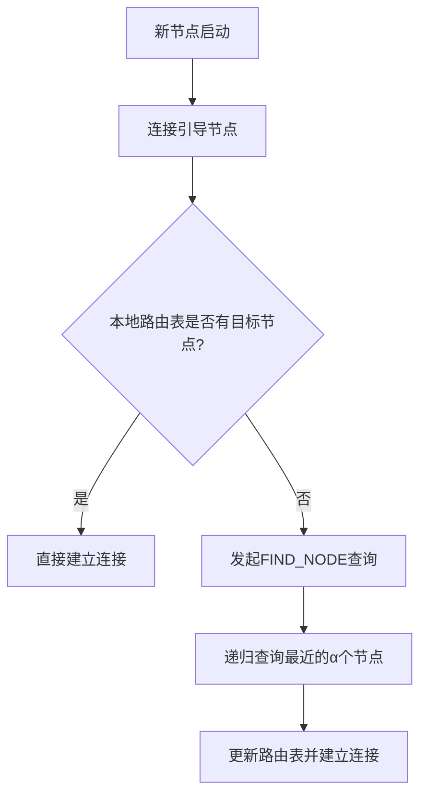
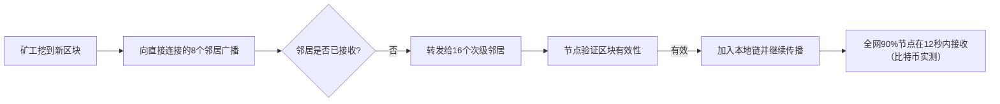
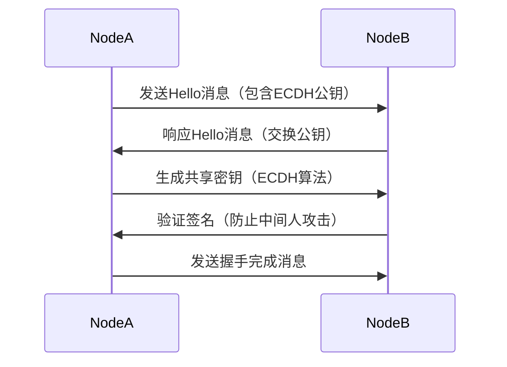
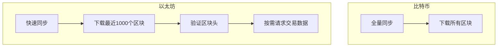
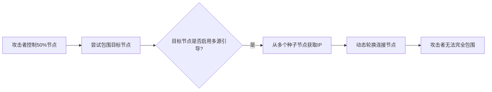
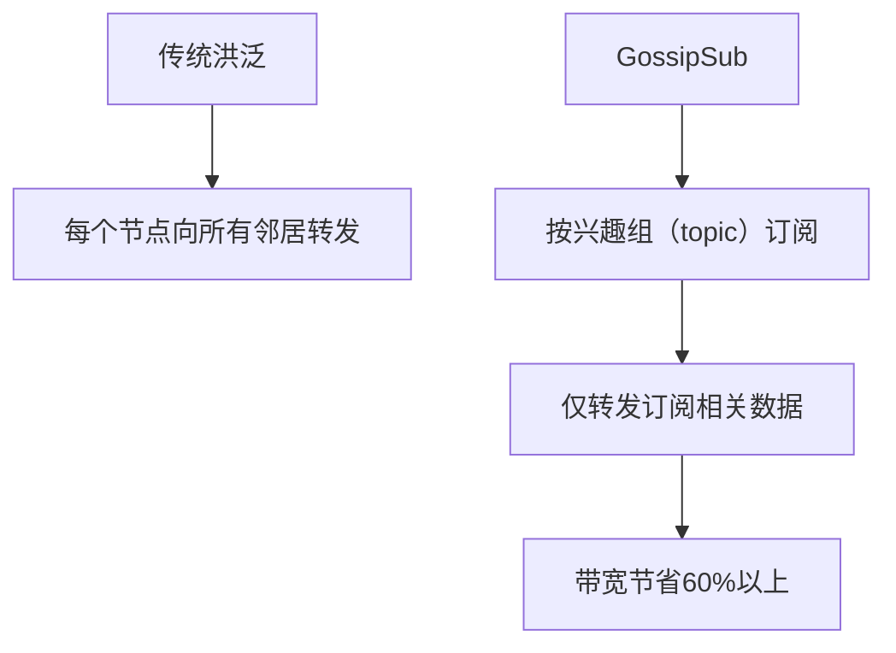
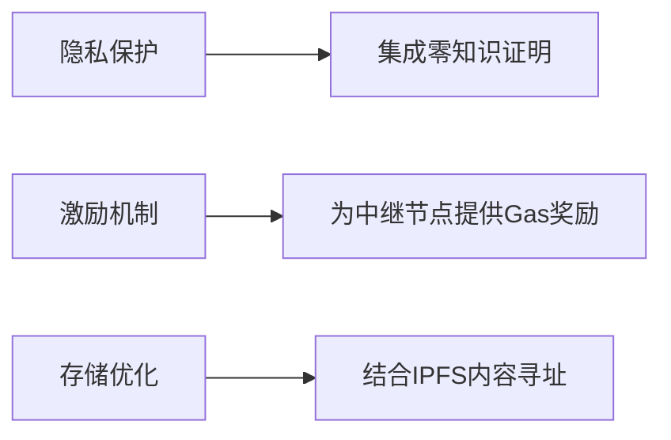

### **P2P网络节点发现与数据传播流程图**


#### **1. 节点发现机制（Kademlia DHT）**


**关键步骤**：
1. **引导节点**：硬编码的种子节点（如比特币的dnsseed.bitcoin.dashjr.org）
2. **KBucket**：按XOR距离分组的路由表，每个桶存储α个节点（比特币α=8，以太坊α=16）
3. **查询响应**：节点返回自身已知的最近节点列表，直到找到目标节点


#### **2. 数据传播协议（Gossip协议）**


**优化策略**：
1. **布隆过滤器**：快速判断是否已接收交易
2. **优先级队列**：高Gas费交易优先传播
3. **交易ID缓存**：24小时内重复交易自动丢弃


#### **3. 以太坊节点认证流程（RLPx协议）**


**安全性保障**：
- 使用椭圆曲线Diffie-Hellman（ECDH）生成共享密钥
- 通过Ed25519签名验证节点身份
- 每次连接生成新密钥，防止长期监听


#### **4. 区块同步机制对比**


**效率提升**：
- 以太坊通过`eth_getProof`接口实现状态快速验证
- 轻节点只需下载区块头（约35KB/区块）
- 基于Merkle证明验证特定交易


### **5. 抗攻击设计（Eclipse攻击防护）**


**防御措施**：
1. 使用多个独立的引导节点（如Tor节点+常规节点）
2. 定期断开旧连接，随机选择新节点（周期<1小时）
3. 限制单个IP的连接数（如最多4个）


### **6. 带宽优化策略**


**技术细节**：
- 以太坊使用`ssz`编码压缩消息
- 区块传输支持Range请求（`eth_getBlockRange`）
- 交易按Gas费排序，优先传播高价值交易


### **7. 未来演进方向**


**代表性项目**：
- **Prysmatic Labs**：研究P2P层的隐私增强技术
- **EIP-3651**：提案为矿工提供Gas费补贴以提升传播速度
- **Swarm**：以太坊官方的分布式存储网络


### **关键公式与指标**
1. **节点发现效率**：
   ```
   发现时间 = 跳数 × 单跳延迟 × log₂(全网节点数)
   ```
   （比特币典型值：3跳 × 100ms × 15 ≈ 4.5秒）

2. **数据传播速度**：
   ```
   传播时间 = 区块大小 / (平均带宽 × 传播系数)
   ```
   （以太坊典型值：1MB / (10Mbps × 0.8) ≈ 1秒）

3. **抗攻击能力**：
   ```
   攻击成本 = 控制节点数 × 单节点运营成本
   ```
   （比特币当前攻击51%节点成本：7500节点 × $500/月 ≈ $3.75M/月）


通过上述机制，区块链P2P网络在去中心化、抗审查和高效性之间取得了平衡，为Web3.0提供了可靠的通信基础设施。