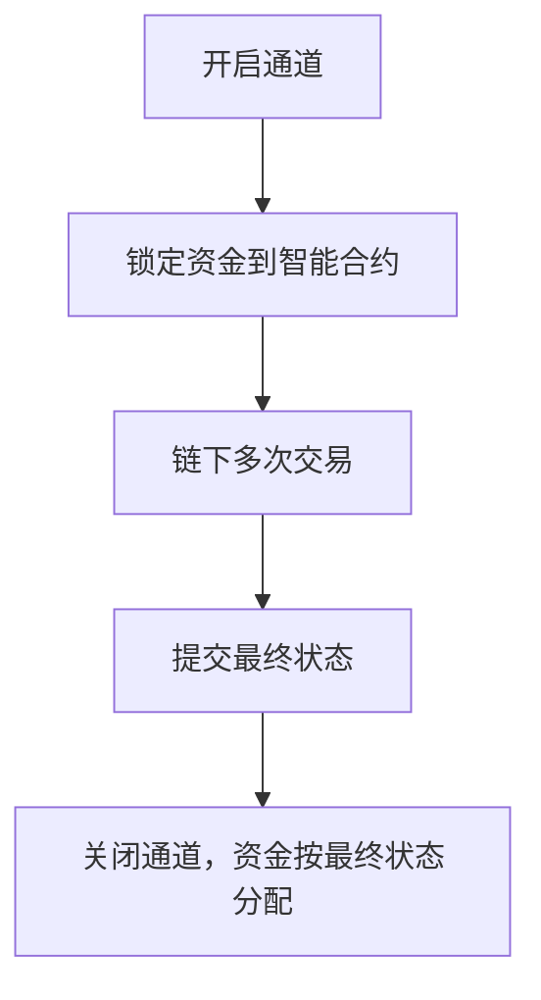
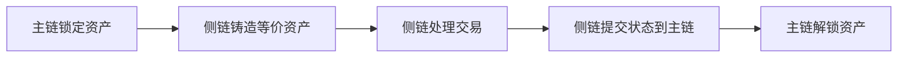
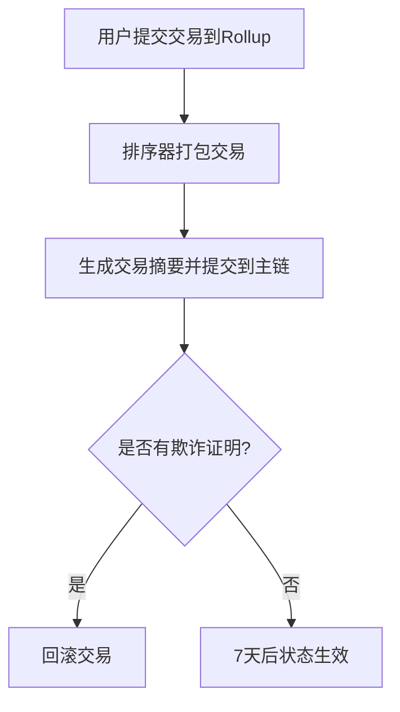
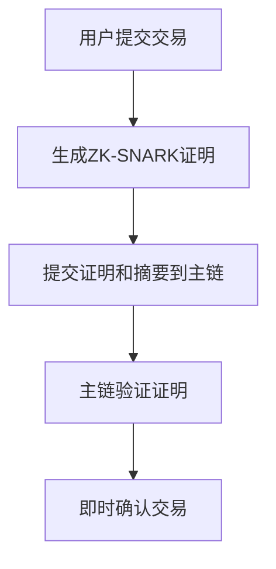

### **Layer2技术深度解析：概念、交易还原与方案对比**

#### **一、Layer2核心概念与Layer1关系**
**1. 核心定义**  
Layer2是构建在区块链主链（Layer1）之上的扩展协议，通过**链下处理**提升交易吞吐量、降低费用，同时依赖Layer1的安全性保障。其核心目标是解决区块链“不可能三角”中的扩展性问题。

**2. 与Layer1的区别**  

| **维度**         | **Layer1（主链）**                | **Layer2（第二层）**              |
|------------------|-----------------------------------|-----------------------------------|
| **功能**         | 共识验证、完整账本存储            | 高频交易处理、链下计算            |
| **TPS**          | 低（如以太坊30 TPS）              | 高（如ZK Rollup 2000+ TPS）       |
| **交易成本**     | 高（受Gas费波动影响）             | 低（链下成本+少量主链费用）       |
| **确认时间**     | 分钟级（依赖区块生成）            | 即时或秒级（链下处理）            |
| **数据存储**     | 完整交易数据                      | 仅摘要或压缩数据（如Rollup）      |
| **去中心化程度** | 完全去中心化                      | 部分依赖中心化组件（如Rollup排序器）|

**3. 协同关系**
- **安全性依赖**：Layer2最终通过Layer1验证（如欺诈证明、零知识证明）。
- **数据交互**：Layer2定期向Layer1提交状态摘要（如Rollup的根哈希）。
- **资产互通**：通过跨链桥或智能合约实现Layer1与Layer2资产转移。

#### **二、Layer2交易还原技术详解**

##### **1. 状态通道（State Channels）**
**原理**：  
通过智能合约锁定资金，双方在链下进行多次交易，最终提交最终状态到主链。  
**流程**：

**案例**：Lightning Network  
**技术细节**：
- 使用HTLC（哈希时间锁合约）实现原子交换。
- 通道容量限制交易金额，需定期重新平衡。

##### **2. 侧链（Sidechain）**
**原理**：  
独立区块链通过双向锚定与主链交互，交易在侧链处理后同步到主链。  
**流程**：

**案例**：Polygon  
**技术细节**：
- 采用PoS共识机制，验证者需抵押主链资产。
- 跨链桥使用智能合约实现资产双向映射。

##### **3. Optimistic Rollup**
**原理**：  
将交易数据压缩后提交到主链，通过欺诈证明验证状态。  
**流程**：

**案例**：Arbitrum  
**技术细节**：
- 挑战期7天，允许任何人质疑错误状态。
- 依赖Geth兼容的VM实现EVM等效性。

##### **4. ZK Rollup**
**原理**：  
利用零知识证明压缩交易数据并验证，直接提交到主链。  
**流程**：

**案例**：zkSync Era  
**技术细节**：
- 使用PlonK证明系统，单批次处理2000+交易。
- 支持ERC-20/ERC-721资产，兼容Solidity智能合约。

#### **三、Layer2方案对比表**

| **方案**          | **优点**                                                                 | **缺点**                                                                 | **典型应用**               |
|-------------------|--------------------------------------------------------------------------|--------------------------------------------------------------------------|----------------------------|
| **状态通道**      | 即时交易、极低手续费、隐私保护。                                         | 资金锁定、通道数量限制、依赖双方在线。                                   | Lightning Network          |
| **侧链**          | 高吞吐量、灵活定制、支持复杂逻辑。                                       | 依赖侧链验证者、存在信任风险、跨链延迟。                                 | Polygon、Binance Smart Chain |
| **Optimistic Rollup** | 高扩展性（2000+ TPS）、兼容EVM。                                      | 挑战期长（7天）、需信任排序器、存在MEV风险。                             | Optimism、Arbitrum         |
| **ZK Rollup**     | 即时确认、高隐私性、无信任假设。                                         | 开发难度大、对复杂逻辑支持有限。                                         | zkSync、StarkNet           |
| **Plasma**        | 高吞吐量、低费用。                                                       | 数据可用性问题、退出期长（7天）、依赖子链运营商。                       | OMG Network                |

#### **四、关键技术指标对比**

| **指标**         | **状态通道** | **侧链** | **Optimistic Rollup** | **ZK Rollup** | **Plasma** |
|------------------|--------------|----------|-----------------------|---------------|------------|
| **吞吐量**       | 无限（通道数限制） | 1000-5000 TPS | 2000-4000 TPS         | 1000-2000 TPS | 约1000 TPS |
| **确认时间**     | 即时（链下）       | 5秒      | 7天（挑战期后）       | 即时          | 5秒（正常） |
| **资金效率**     | 低（锁定）         | 高       | 高                    | 高            | 低（锁定） |
| **信任假设**     | 双方诚实         | 侧链验证者 | 排序器诚实            | 无需信任      | 子链运营商 |
| **隐私保护**     | 高             | 低       | 低                    | 高            | 低          |

#### **五、总结与选择建议**
1. **高频小额支付**：状态通道（如Lightning Network）是首选。
2. **复杂DApp部署**：Optimistic Rollup（如Arbitrum）或侧链（如Polygon）更合适。
3. **隐私敏感场景**：ZK Rollup（如StarkNet）提供最佳隐私保护。
4. **历史兼容性**：Plasma适合需与旧系统集成的项目。

**关键公式**：  
Layer2性能 = (主链吞吐量 × 压缩率) / 证明成本  
（示例：以太坊30 TPS × 100倍压缩 = 3000 TPS，减去证明开销后约2000 TPS）

参考 [git w3](https://github.com/Base1-Go/Web3/blob/main/6.%E8%BF%98%E5%8E%9F%E4%BA%A4%E6%98%93/6.%E8%BF%98%E5%8E%9F%E4%BA%A4%E6%98%93.md)