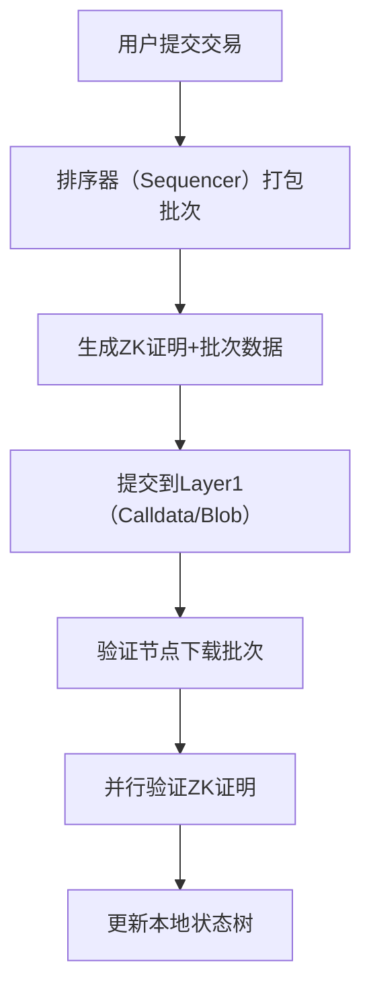
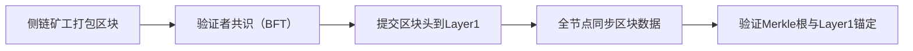
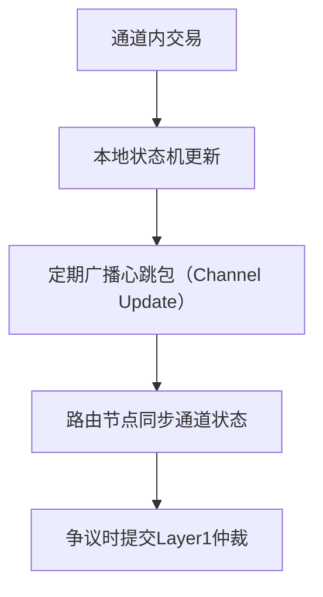
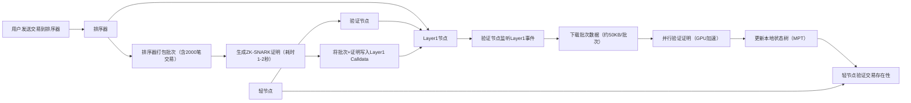

### **Layer2区块同步技术深度解析：机制、挑战与优化**

#### **一、Layer2区块同步核心机制**
Layer2的区块同步指**验证节点/全节点**通过网络获取并验证Layer2交易数据，确保本地状态与全网一致的过程。其核心依赖**Layer1数据锚定**和**高效的链下共识**，不同方案机制差异显著：

##### **1. Rollup（以ZK Rollup为例）**

- **数据锚定**：批次数据以Calldata（Optimism）或Blob（以太坊坎昆升级后）存储于Layer1
- **一致性保障**：ZK证明强制状态正确性，节点通过验证证明确保数据一致
- **排序器**：早期中心化（如zkSync Era），未来趋向去中心化（如zkPorter）

##### **2. 侧链（以Polygon PoS为例）**

- **共识机制**：独立的BFT共识（如Polygon的2/3验证者签名）
- **轻节点同步**：仅下载区块头，通过Merkle证明验证交易
- **跨链验证**：Layer1通过`POSClient`合约存储侧链区块头

##### **3. 状态通道（以Lightning Network为例）**

- **同步粒度**：仅同步通道相关状态，非全局区块
- **最终一致性**：依赖Layer1智能合约的最终仲裁
- **路由节点**：通过gossip协议同步通道可用性

#### **二、同步过程关键挑战与解决方案**

| **挑战**               | **影响**                     | **解决方案**                                                                 |
|------------------------|------------------------------|-----------------------------------------------------------------------------|
| **数据可用性缺失**     | 节点无法获取完整交易数据     | ① 强制排序器将数据写入Layer1（如Arbitrum Nitro） ② 数据可用性采样（DAS） |
| **排序器中心化风险**   | 单点故障或恶意排序           | ① 去中心化排序（如zkSync 2.0的排序委员会） ② 多排序器竞争（Optimism Bedrock） |
| **同步延迟**           | 节点状态滞后导致分叉         | ① 并行验证（Parallel Verification） ② 区块分片（如StarkNet的Validum） |
| **存储爆炸**           | 历史数据占用过多磁盘空间     | ① 状态快照（State Snapshot） ② 基于时间的垃圾回收（如Arbitrum的Chain Data Retention） |
| **欺诈证明挑战**       | Optimistic Rollup的长挑战期   | ① 链下快速争议解决（如Arbitrum的Orbit Chain） ② 优化欺诈证明生成效率     |

#### **三、Layer2同步流程图（以ZK Rollup为例）**

**关键节点**：
- 排序器：每秒处理2000笔交易，生成批次
- Layer1：作为数据可用性层，存储不可篡改的批次数据
- 验证节点：通过GPU并行验证证明，吞吐量达2000 TPS
- 轻节点：仅存储状态树根，通过Merkle证明验证交易

#### **四、技术笔记：关键知识点与优化建议**

##### **1. 核心知识点**
- **数据可用性优先**：Layer2的同步必须依赖Layer1的不可篡改性，所有交易数据必须可在Layer1追溯（如Calldata/Blob）。
- **证明驱动同步**：ZK Rollup通过零知识证明跳过交易逐条验证，验证时间从O(n)降至O(1)。
- **状态压缩**：使用Patricia树（MPT）存储账户状态，仅同步路径上的节点变化（如zkSync的Delta树）。

##### **2. 优化方向**
- **去中心化排序**：通过排序委员会（Sequencer Committee）替代单一排序器（如zkSync 3.0提案）。
- **数据分片**：将批次数据分片存储，节点按需下载（如StarkNet的Validum分片）。
- **增量同步**：仅同步状态差异（State Delta），而非全量数据（如Optimism的Bedrock升级）。
- **硬件加速**：利用GPU/ASIC加速ZK证明生成与验证（如StarkWare的专用证明设备）。

##### **3. 典型案例对比**
| **方案**       | 同步延迟 | 验证方式       | 数据可用性保障          | 存储成本（1年） |
|----------------|----------|----------------|-------------------------|----------------|
| zkSync Era     | <1秒     | ZK证明         | Layer1 Calldata         | 200GB          |
| Arbitrum Nitro | 1-2秒    | 欺诈证明       | 强制排序器发布到Layer1  | 150GB          |
| Polygon PoS    | 5秒      | BFT共识        | 侧链节点存储            | 500GB          |

#### **五、总结**
Layer2的区块同步是**效率与安全的平衡艺术**：
- **Rollup**依赖Layer1的数据可用性和密码学证明，适合高安全需求场景。
- **侧链**通过独立共识实现高吞吐量，但需信任验证者。
- **状态通道**聚焦局部同步，适合高频小额场景。

**未来趋势**：
1. 以太坊Blob存储（EIP-4844）将降低Rollup数据成本90%以上。
2. 去中心化排序+DAS（数据可用性采样）成为Layer2标配（如Celestia生态）。
3. 硬件加速的证明算法（如递归证明）将使ZK Rollup吞吐量突破10万 TPS。

**关键公式**：  
同步效率 = 批次大小 / (证明生成时间 + 网络传输延迟)  
（示例：2000笔/批次 ÷ (1秒 + 0.5秒) = 1333 TPS，理论极限受限于Layer1写入速度）