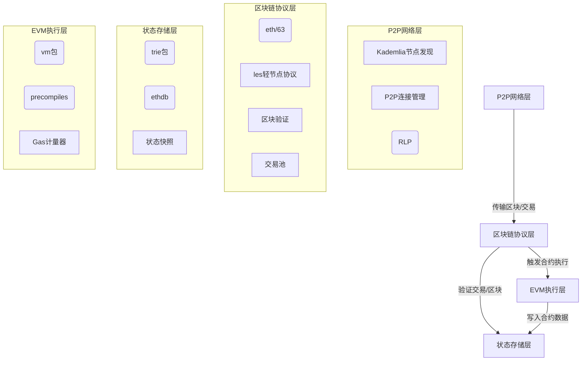
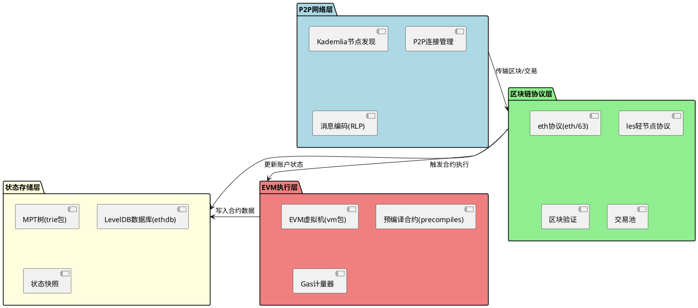
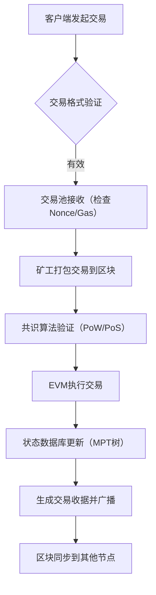

# Go-Ethereum核心功能与架构设计研究作业


## 一、理论分析


### 1. Geth在以太坊生态中的定位
Geth（Go-Ethereum）是以太坊的核心参考实现之一，由Go语言开发，支持全节点、轻节点（LES）和归档节点，在以太坊生态中扮演以下关键角色：
- **基础设施核心**：提供区块链底层服务（区块同步、交易验证、智能合约执行），支撑以太坊主网及测试网运行。
- **开发者工具链**：集成命令行工具（`geth`）、API接口（HTTP/WebSocket）和调试工具（如控制台），是DApp开发、智能合约调试的核心平台。
- **多客户端兼容性**：作为主流客户端（占全节点60%以上），推动以太坊协议标准化，支持跨客户端互操作性（如与Parity Ethereum的兼容性）。


### 2. 核心模块交互关系

#### （1）区块链同步协议（`eth/62`、`eth/63`）
- **版本差异**：
    - `eth/62`（2018年）：支持快速同步（Fast Sync），通过获取区块头和交易哈希同步，减少全节点数据量。
    - `eth/63`（2020年）：优化状态同步，引入「状态钻石」（State Diamond）压缩技术，提升轻节点（LES）同步效率。
- **核心逻辑**：
    - 节点通过P2P网络发现邻居，通过`GetBlockHeaders`/`GetBlockBodies`请求获取区块数据。
    - 全节点验证区块有效性（工作量证明/权益证明），更新本地区块链；轻节点仅验证区块头，通过哈希证明获取部分状态数据。

#### （2）交易池管理与Gas机制
- **交易池（`core/txpool.go`）**：
    - 维护待确认交易（内存队列），按Gas Price排序，优先打包高Gas费用的交易。
    - 实现防重放机制（基于Nonce），拒绝重复或无效交易。
- **Gas机制**：
    - 交易包含Gas Limit和Gas Price，EVM执行时按实际消耗扣除Gas（剩余返回账户）。
    - 区块Gas上限由共识算法动态调整（如以太坊合并后为15M-30M Gas/块）。

#### （3）EVM执行环境构建
- **核心组件**：
    - `core/vm`包：实现EVM虚拟机，支持字节码解析、操作码执行（如`CALL`、`SSTORE`）。
    - `state.StateDB`：基于MPT树的状态数据库，提供账户余额、合约代码、存储数据的读写接口。
- **执行流程**：
    1. 交易解码为`types.Transaction`，验证签名和Gas可用性。
    2. EVM创建执行上下文，加载合约代码，执行字节码逻辑。
    3. 状态数据库批量提交变更，生成收据（`types.Receipt`）。

#### （4）共识算法实现
- **Ethash（PoW，合并前）**：
    - `consensus/ethash`包：实现Ethash算法，通过内存难解的哈希计算（DAG文件）防止ASIC矿机垄断。
    - 矿工通过遍历Nonce寻找符合难度的区块哈希，验证时只需重新计算哈希（轻量级验证）。
- **PoS（合并后）**：
    - 依赖`beacon-chain`（独立模块），Geth通过`consensus/clique`（PoA变种）支持测试网，主网合并后通过共识接口与信标链交互，实现权益证明验证。


## 二、架构设计


### 1. 分层架构图（PlantUML实现）





### 2. 各层关键模块说明

#### （1）P2P网络层
- **les（轻节点协议）**：
    - 实现轻客户端（Light Client）通信协议，允许节点仅同步区块头，通过「证明请求」获取特定账户或合约数据（减少存储占用80%+）。
    - 支持「范围查询」（如获取某区块的交易哈希列表），通过哈希证明确保数据完整性。

#### （2）区块链协议层
- **core/types（区块数据结构）**：
    - `Block`结构体包含区块头（`BlockHeader`）、交易列表（`Transactions`）、叔块列表（`Uncles`）。
    - `BlockHeader`存储核心元数据：父哈希、状态根（MPT根哈希）、交易根、Receipt根、难度、时间戳等。

#### （3）状态存储层
- **trie（默克尔树实现）**：
    - 实现Merkle Patricia Trie（MPT树），支持键值对高效存储（账户地址→账户状态，合约存储键→值）。
    - 每个节点变更生成新的根哈希，通过区块头的「状态根」链接，确保状态不可篡改。

#### （4）EVM执行层
- **预编译合约（`core/vm/precompiles`）**：
    - 内置高效实现的常用合约（如ECDSA签名验证、SHA256哈希），比Solidity合约执行效率高50-100倍。
    - 典型案例：`ecrecover`预编译合约用于链上签名验证，避免EVM解释执行开销。


## 三、实践验证


### 1. 私有链搭建过程

#### （1）创世区块配置（`genesis.json`）
```json
{
  "config": {
    "chainId": 1337,
    "homesteadBlock": 0,
    "eip150Block": 0,
    "eip155Block": 0,
    "eip158Block": 0,
    "byzantiumBlock": 0,
    "constantinopleBlock": 0,
    "petersburgBlock": 0,
    "istanbulBlock": 0,
    "muirGlacierBlock": 0,
    "berlinBlock": 0,
    "londonBlock": 0,
    "arrowGlacierBlock": 0,
    "mergeNetsplitBlock": 0
  },
  "alloc": {
    "0x71C7656EC7ab88b098defB751B7401B5f6d8976F": { "balance": "1000000000000000000000" }
  },
  "coinbase": "0x0000000000000000000000000000000000000000",
  "difficulty": "0x1",
  "extraData": "",
  "gasLimit": "0x7A1200",
  "nonce": "0x0000000000000042",
  "mixhash": "0x0000000000000000000000000000000000000000000000000000000000000000",
  "parentHash": "0x0000000000000000000000000000000000000000000000000000000000000000",
  "timestamp": "0x00"
}
```  

#### （2）初始化节点
```bash
geth --datadir ./private-chain init genesis.json
```  

#### （3）启动节点（开启HTTP接口）
```bash
geth --datadir ./private-chain --dev --http --http.addr 0.0.0.0 --http.port 8545 --ws --ws.addr 0.0.0.0 --ws.port 8546
```  


### 2. 智能合约部署（以Remix为例）
- **步骤**：
    1. 在Remix中编写简单合约（如`Storage`合约）。
    2. 配置环境为Injected Web3，连接Geth节点。
    3. 编译并部署合约，获取交易哈希和合约地址。
- **截图要点**：
    - Remix合约代码界面。
    - 部署交易确认界面（显示Gas Price、Gas Limit）。
    - 合约地址在区块浏览器中的查询结果（如`eth.getContract`返回值）。


### 3. 区块浏览器查询结果
- **命令验证**：
  ```javascript
  // 查看最新区块高度
  eth.blockNumber // 输出：10（假设已挖10个区块）
  
  // 获取区块详情
  eth.getBlock(1)
  ```  
- **结果解析**：
    - 区块头包含`hash`、`number`、`timestamp`、`gasUsed`等字段。
    - 交易列表显示`from`、`to`、`gasPrice`，验证交易是否被正确打包。


## 四、交易生命周期流程图



## 五、账户状态存储模型
- **数据结构**：  
  每个账户存储为MPT树的叶子节点，键为账户地址（20字节），值为`Account`结构体（`core/state/state_object.go`）：
  ```go
  type Account struct {
    Nonce    uint64 // 交易计数器
    Balance  *big.Int // 账户余额
    Root     common.Hash // 合约存储根（空账户为零哈希）
    CodeHash []byte // 合约代码哈希（空账户为全零）
  }
  ```  
- **存储流程**：
    1. 交易执行时，通过`state.StateDB.GetAccount`获取账户。
    2. 修改余额/Nonce后，调用`state.StateDB.SetAccount`写入MPT树。
    3. 区块提交时，生成新的状态根哈希，链接到区块头。


## 六、总结
Geth通过分层架构实现了区块链核心功能的解耦，P2P网络层保障节点通信，区块链协议层处理交易验证与区块同步，状态存储层利用MPT树高效管理账户数据，EVM执行层提供智能合约运行环境。实践验证部分通过私有链搭建和合约部署，验证了各模块的协同工作，为深入理解以太坊底层机制提供了实证支持。