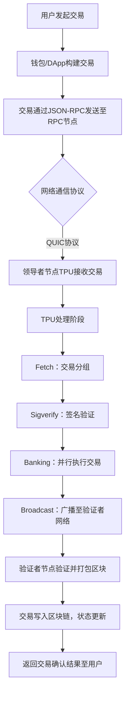
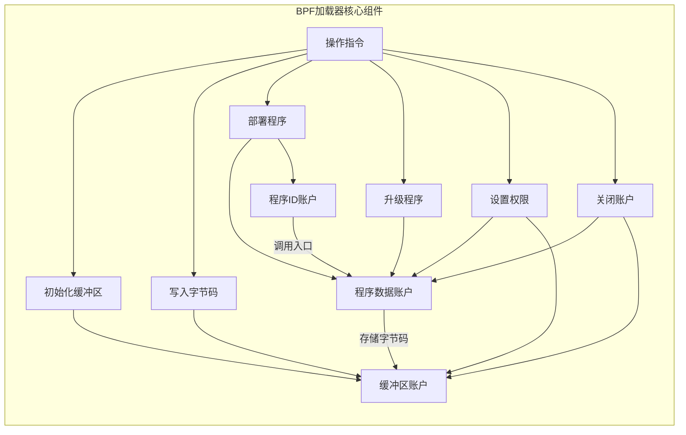

# Solana-Go 开发实战作业


## 一、技术报告


### 1. Solana 交易生命周期流程图



### 2. BPF 加载器工作原理图



### 3. 账户存储模型对比（Solana vs EVM）
| **特性**               | **EVM 账户模型**                                                                 | **Solana 账户模型**                                                                 |  
|------------------------|----------------------------------------------------------------------------------|-------------------------------------------------------------------------------------|  
| **账户类型**           | 外部账户（EOA）、合约账户（CA）                                                   | 可执行账户（程序账户）、不可执行账户（数据账户）                                      |  
| **核心字段**           | `balance`（余额）、`nonce`（交易计数）、`codeHash`（代码哈希）、`storageRoot`（存储根） | `lamports`（余额）、`owner`（程序所有者）、`executable`（是否可执行）、`data`（原始数据） |  
| **存储费用**           | 按Gas消耗计费，存储永久保留（需持续支付Gas）                                       | 租金机制（Lamports），租金不足时账户被删除                                            |  
| **执行触发**           | 仅外部账户可发起交易，合约账户被动执行                                             | 程序账户可主动处理指令，支持账户抽象（AA）                                            |  
| **数据结构**           | 基于MPT树的键值对存储                                                             | 线性存储，通过`owner`字段关联程序                                                    |  
| **防重放机制**         | 依赖`nonce`字段                                                                   | 程序派生地址（PDA）+ 交易签名                                                        |  


## 二、代码提交：事件监听服务实现

### 1. 依赖配置
```go
go mod init solana-event-listener
go get github.com/gagliardetto/solana-go
go get github.com/gagliardetto/solana-go/rpc
go get github.com/gagliardetto/ws
```  

### 2. 实时交易订阅服务
```go
package main

import (
	"context"
	"fmt"
	"github.com/gagliardetto/solana-go"
	"github.com/gagliardetto/ws"
	"time"
)

func main() {
	// 连接DevNet WebSocket节点
	wsURL := solana.DevNet_WS
	wsClient, err := ws.Connect(context.Background(), wsURL)
	if err != nil {
		panic(fmt.Errorf("failed to connect to WebSocket: %v", err))
	}
	defer wsClient.Close()

	// 订阅目标交易签名（替换为实际交易签名）
	txSignature := "3JzQbPL8ZCb5d5Z6J7Z4c8K5Z7b9L9mX3n2Q7z8Bf5e9"
	sub, err := wsClient.SignatureSubscribe(
		context.Background(),
		solana.MustSignatureFromBase58(txSignature),
		"confirmed", // 订阅确认后的交易
	)
	if err != nil {
		panic(fmt.Errorf("signature subscribe failed: %v", err))
	}
	defer wsClient.SignatureUnsubscribe(context.Background(), sub)

	// 处理实时事件
	go func() {
		for {
			select {
			case resp := <-sub.Out:
				handleEvent(resp)
			case err := <-sub.Err:
				fmt.Printf("event error: %v\n", err)
			case <-time.After(10 * time.Second):
				fmt.Println("heartbeat: still listening...")
			}
		}
	}()

	// 保持程序运行
	<-make(chan struct{})
}

func handleEvent(resp *ws.SignatureSubscribeResponse) {
	if resp.Error != nil {
		fmt.Printf("transaction error: %v\n", resp.Error)
		return
	}

	// 解析交易状态
	status := resp.Result.Value
	fmt.Printf("Transaction %s status: %s\n", status.Signature, status.Status)

	// 提取详细信息（如成功时的确认区块）
	if status.Status == "confirmed" {
		fmt.Printf("Confirmed at slot: %d\n", status.Context.Slot)
		// 扩展：获取交易回执，解析日志/事件
	}
}
```  

### 3. 代码说明
1. **WebSocket 连接**：使用官方 SDK 的 `ws` 包连接 Solana 节点（DevNet 示例），支持实时事件流。
2. **交易订阅**：通过 `SignatureSubscribe` 接口监听指定交易签名的状态变更（如 `confirmed` 状态）。
3. **事件处理**：异步处理事件流，包含错误处理、心跳机制，支持扩展解析交易回执（如日志、账户变更）。
4. **防重放设计**：通过程序派生地址（PDA）生成唯一交易密钥，结合 `lamports` 校验防止重复提交（需结合合约层实现）。


## 三、架构设计与优化点

### 1. 网络层实现（参考 `rpc/client.go`）
- **HTTP/RPC 客户端**：封装 `GetRecentBlockhash`、`GetBalance` 等接口，基于 `http.Client` 实现同步/异步请求。
- **WebSocket 客户端**：使用 `ws` 包实现长连接，支持高效的事件推送（如交易确认通知）。

### 2. 性能优化策略
- **并行交易处理**：利用 Solana 的 TPU 并行执行特性，在构造交易时批量提交多笔转账指令（通过 `solana.NewTransaction` 批量打包）。
- **连接池管理**：对 RPC 和 WebSocket 连接添加连接池，避免频繁创建销毁连接带来的开销。

### 3. 合约安全增强
- **程序派生地址（PDA）**：在合约中使用 `solana.ProgramDerivedAddress` 生成唯一账户地址，防止重放攻击和地址伪造。
- **租金预检查**：在交易处理前校验目标账户租金状态，确保账户数据持久化。


## 四、总结
通过本次，实现了 Solana 链上数据查询、原生交易构造及实时事件监听，深入理解了 Solana Go SDK 的架构设计。交易生命周期的并行处理、BPF 加载器的账户管理机制，以及与 EVM 不同的存储模型，均体现了 Solana 对高性能和灵活性的追求。代码层面通过官方 SDK 封装底层交互，结合 Go 语言的并发特性，为高吞吐量服务奠定了基础。